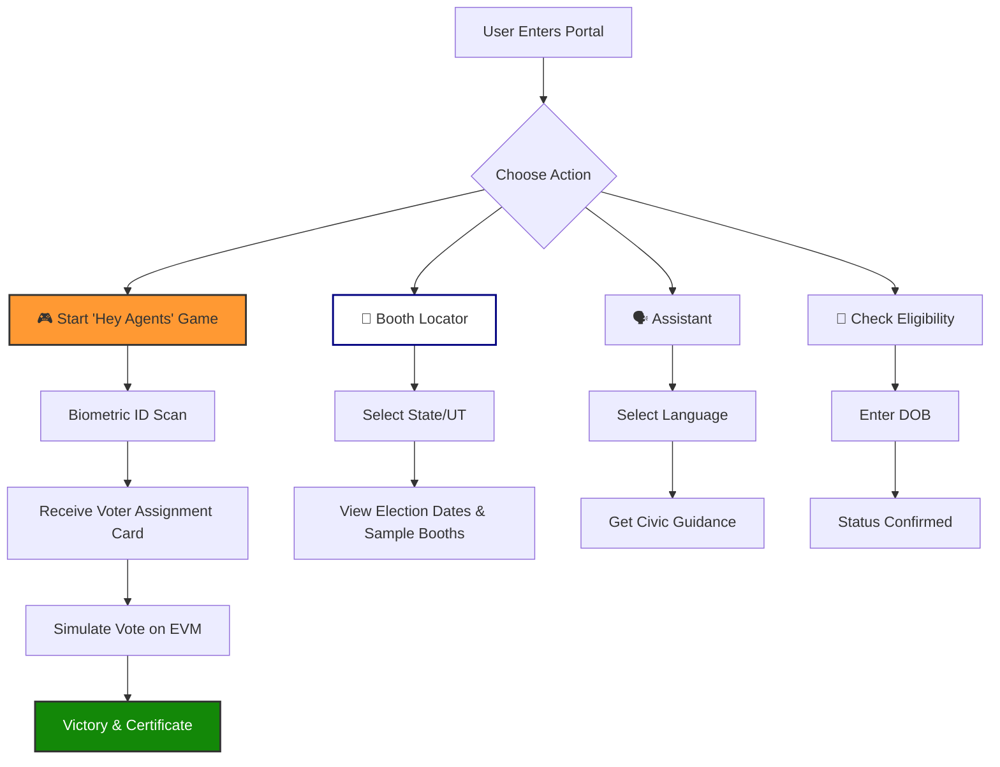

# 🇮🇳 Indian Election Civic Portal — "Hey Agents, Help Me!"

An immersive, high-fidelity, and story-driven web experience designed to educate and guide Indian citizens through the voting process. This portal transforms civic engagement into a cinematic journey, combining gamified mechanics with essential electoral information.

## 🚀 Live Demo
**URL:** [https://indian-election-portal-376040388907.asia-south1.run.app](https://indian-election-portal-376040388907.asia-south1.run.app)

---

## ✨ Key Features

### 1. 🎮 "Hey Agents, Help Me!" Cinematic Game
A first-person, visual-novel-style experience where the player acts as a voter.
- **Biometric Scan:** Interactive identity verification with procedural VFX and sound.
- **Voter Assignment:** Dynamic holographic card generation showing assigned booth name, number, and polling date.
- **EVM Simulation:** Tactile voting machine interface with authentic auditory feedback.

### 2. 📍 Advanced Booth Locator
Comprehensive data coverage for all **28 States and 8 Union Territories**.
- **Regional Data:** Displays specific election dates, phases, and polling hours for every region.
- **Booth Cards:** Renders styled cards for sample polling stations in the selected area.
- **ECI Integration:** Direct links to the official ECI portal for final verification.

### 3. 🗣️ Multilingual AI Assistant
A conversational interface supporting **16 Indian languages** (Hindi, Bengali, Telugu, Marathi, Tamil, etc.).
- Helps users with registration steps, ID requirements, and general FAQs.

### 4. 📊 Interactive Dashboard
- **Eligibility Checker:** Real-time age and residency validation.
- **Timeline:** Step-by-step electoral calendar from registration to result day.
- **Comic Journey:** A 7-step visual guide to the voting day experience.

---

## 🛠️ Technology Stack
- **Frontend:** Pure HTML5, CSS3 (3D Transforms, Keyframe Animations), and Vanilla JavaScript.
- **Audio:** Web Audio API (Zero external assets).
- **Deployment:** Dockerized Nginx server.
- **Infrastructure:** Google Cloud Run (Serverless).

---

## 🗺️ Project Architecture & User Journey



---

## 📦 Deployment Instructions

1. **Build Container:**
   ```bash
   docker build -t indian-election-portal .
   ```

2. **Deploy to Cloud Run:**
   ```bash
   gcloud run deploy indian-election-portal --source . --region asia-south1
   ```

---

## 🇮🇳 Credits
Developed to empower the citizens of India. **Jai Hind!**